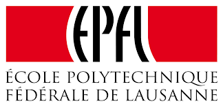

         

# modERN : mod-EPFL Researchers Network

*modERN* is a project that is going to be developed during the next months. It has the presumption of proposing a *mod* description, analysis and exploration of the *EPFL Researchers Network*. In order to make it as much *mod* as possible, many techniques, that represent the *state of the art* in the graph theory, are used. Furthermore, the data viz tools will help us in illustrating the results of the analysis.

Stay tuned, the best is coming!

But, what is [*mod*](https://en.wikipedia.org/wiki/Mod_(subculture)) exactly?
