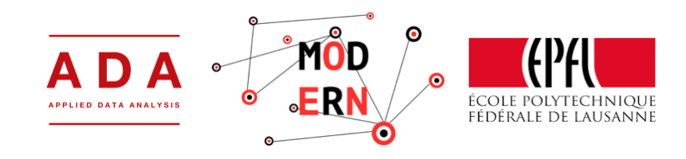

# modERN : mod-EPFL Researchers Network

*modERN* is a project that is going to be developed during the next months. It has the presumption of proposing a *mod* description, 
analysis and exploration of the *EPFL Researchers Network*. In order to make it as much *mod* as possible, many techniques, 
that represent the *state of the art* in the graph theory, are used. Furthermore, the data viz tools will help us in illustrating 
the results of the analysis. Even if pretentious, in the end we may try to do some *generative art* exploiting the obtained data and results.

Stay tuned, the best is coming!

But, what is [*mod*](https://en.wikipedia.org/wiki/Mod_(subculture)) exactly?

      "the mass media often used the term mod in a wider sense to describe anything that was believed to be popular, fashionable or modern."

## Abstract

We present *modERN*, both an analysis of the research community of the EPFL, a university recognised as an excellence in terms of research, 
and a visual exploration of the *white hot* topics which the research is addressed to. *modERN* focuses its attention on discovering which 
departments collaborate and share information, how the interactions between groups change over time and the influence of one on the other. 
Using different data sources *modERN* estimates the potential of researches carried out at the EPFL, 
whether they are acknowledged by the scientific community, and guesses the researchers that will work on certain topics in the future. 
*modERN* represents the network as a graph whose nodes are researchers and edges represent collaboration between them.

## Data description

We use two source of data:

* [*infoscience*](https://infoscience.epfl.ch/collection/Infoscience/Research?ln=en): the official EPFL platform that collects
 the entire scientific production of the university. We will use this data to build the entire and complete graph. Since *infoscience* is
 an official container of data, we assume that the information retrieved from it is adjourned, correct, complete and reliable. Hence, we 
 use it as basis of the network. The information fetched from the *website* are:
 - Authors of the paper
 - Paper's authors that belong to the EPFL community
 - Journal where the paper has been submitted to
 - Title of the paper
 - Abstract
 - Link to related works
 - Key words, topic
 - Laboratory
 - Paper pfd
 
 
* [*Google Scholar*](https://scholar.google.ch/citations?view_op=view_org&hl=it&org=16539297749990713900): the information retrieved from 
this platform will be on the top of those collected from *infoscience*. We do not use *Google Scholar* as starting point since not all
researchers necessary have an account.

Additional data about researchers:
 - University
 - Position in the university
 - Fields of application
 - Number of citations
 - List of co-authors
 - *h*index
 - List of papers
  
About paper:
 - Year of publication
 - Number of citation
 
The data are going to be collected as `html` files, then the information fetched from them will be stored in a `noSQL` database, like 
*MongoDB*.

## Feasibility and Risks

Scraping *Google Scholar* may be tricky since there are no clear rules related to the query limits that *Google* allows. Due to this
problem, in order to avoid the excess of allowed query, we will employ some tricks like:
 - Set random time query
 - Make request from different browsers
 - Randomise queries order to get rid off the *causality* between consequencial queries
 - Anonymous crawling with Tor

## Deliverables

The work ends up with as follows:

 - Database
 - Graph and analysis
 - Graph interactive viz
 - (Generative art/stylised viz) 

## Timeplan

1. Collect data
2. Analysis
3. Visualisation

